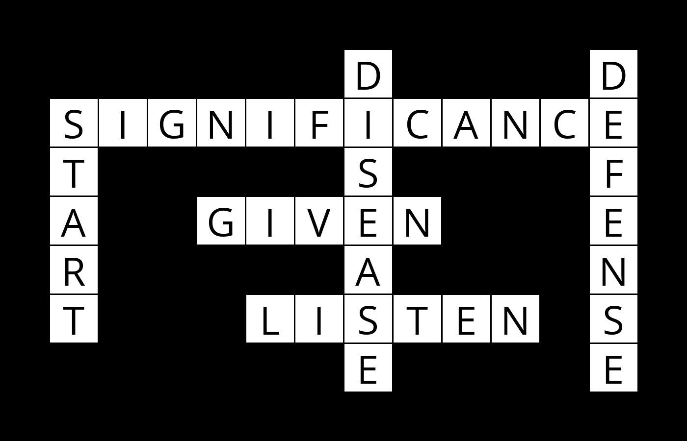

# harvard-CS50AI
This repository serves as a way for me to document my experience
with the [CS50 Artificial Intelligence class](https://cs50.harvard.edu/ai/2020/).

Following is just a little description about each of the assignments.
I do so to keep a thorough documentation on concepts that each assignment employs.

DISCLAIMER: This is internet, so I can't really tell you what to do. 
However, please consider the fact that this a violation of the [edX Honor Code](https://www.edx.org/edx-terms-service.) to just copy-paste the code. 
So please consider the sole purpose of this repository is to just hack around. 

<h2>Week 0: Search</h2>

**Degrees (BFS)** [see directory](https://github.com/dtemir/harvard-CS50AI/tree/master/degrees):
    
* The assignment is about finding the shortest path between two nodes
* The database comes from IMDb, and the task is to tell how one actor is connected to another through their common movie casts
* The solution is based on Breadth-First Search (BFS) because the task requires the shortest path between nodes
* To implement the search, I used a Queue-based Frontier. The Frontier is filled with neighboring nodes that share the same parameter(movie)
* You can find the demonstration of how it works [here](https://www.youtube.com/watch?v=0bksDFskiRM&t=1s&ab_channel=DamirTemir)
* You can find my explanation on [**Medium**](https://damirtemir.medium.com/do-all-hollywood-actors-know-each-other-breadth-first-search-in-action-1b37df515928).

      $ python degrees.py large
      Loading data...
      Data loaded.
      Name: Emma Watson
      Name: Jennifer Lawrence
      3 degrees of separation.
      1: Emma Watson and Daniel Radcliffe starred in Harry Potter and the Chamber of Secrets
      2: Daniel Radcliffe and James McAvoy starred in Victor Frankenstein
      3: James McAvoy and Jennifer Lawrence starred in Dark Phoenix
    

**Tic-Tac-Toe (Minimax)** [see directory](https://github.com/dtemir/harvard-CS50AI/tree/master/tictactoe):

* The assignment is about writing an AI algorithm to play Tic-Tac-Toe optimally
* The pygame module provided inside the <code>runner.py</code> file was outside the scope of the project
* The solution is based on Minimax decision rule which perfectly works for games that clash two opponents against each other
    * The algorithm is all about calculating the best utility out of all possible solutions. 
    * The algorithm relies on calculating prospective steps that the opponent might take

* The <code>tictactoe.py</code> file (where the solution lies) consists of many minor functions that construct the game of Tic-Tac-Toe (finding out who is a winner, etc.)
I recommend paying better attention to the last function called <i>minimax</i>
    * The function determines which side AI plays for, and then finds the best optimal score that the AI can get

* You can find the demonstration of how it works [here](https://www.youtube.com/watch?v=jgmtzfJTEgY&ab_channel=DamirTemir)
* You can find my explanation on [**Medium**](https://medium.com/analytics-vidhya/minimax-algorithm-in-tic-tac-toe-adversarial-search-example-702c7c1030eb).

<h2>Week 1: Knowledge</h2>

**Knights (Propositional Logic & Inference)** [see directory](https://github.com/dtemir/harvard-CS50AI/tree/master/knights):

* The assignment is about solving puzzles using propositional logic
* Using given module <code>logic.py</code>, the puzzles first need to be presented
    * We first need to define base knowledge in each of the knowledge bases, such as that knaves only lie and knight only tell the truth
    * Then, given the statements of symbols (e.g. Symbol A says "We're both knaves" and Symbol B says nothing), we need to represent them using logic
        *  This case involves using biconditionals to show that if A is a knight, his words are true and if not, they are lies

* Using logic, such as and (∧), or (∨), biconditional (↔), inference can be derived that has the answer
* You can find the demonstration of how it works [here](https://youtu.be/iIk04q98ArE).

      $ python puzzle.py 
      Puzzle 0
          A is a Knave
      Puzzle 1
          A is a Knave
          B is a Knight
      Puzzle 2
          A is a Knave
          B is a Knight
      Puzzle 3
          A is a Knight
          B is a Knave
          C is a Knight

**Minesweeper (Propositional Logic & Inference)** [see directory](https://github.com/dtemir/harvard-CS50AI/tree/master/minesweeper):

* The assignment is about solving minesweeper by drawing inference on every available state
* Each piece of knowledge is represented as a sentence that has a set of cells and a number of mines that the set contains
* By knowing that a set is a subset of another set, we can tell they share the number of mines, which means that we can eliminate potential cells from the set (which is inference)
* It is important to keep trying to derive inferences from the available knowledge every time something new is given or found
* You can find the demonstration of how it works [here](https://youtu.be/8DDpr0TY8Pw).

<h2> Week 2: Uncertainty</h2>

**Pagerank (Markov Models)** [see directory](https://github.com/dtemir/harvard-CS50AI/tree/master/pagerank):

* The assignment is about using probability to determine pagerank for html pages
* The <code>pagerank.py</code> has two functions: <code>sample_pagerank</code> and <code>iterative_pagerank</code>
    * Random Surfer Model (<code>sample_pagerank</code>) is about using transition models to represent a state in Markov Chain and choose among its links to pages at random
    * Iterative Algorithm (<code>iterative_pagerank</code>) is about using a recursive mathematical expression to see what the pagerank would be

* It is important to note that normalization of all the resulted vectors is required in <code>iterative_pagerank</code> as some overall probability might result in more than 1
* You can find the demonstration of how it works [here](https://www.youtube.com/watch?v=LxuCrbKrNvs).

      $ python pagerank.py corpus2
      PageRank Results from Sampling (n = 10000)
        ai.html: 0.1888
        algorithms.html: 0.1021
        c.html: 0.1239
        inference.html: 0.1327
        logic.html: 0.0282
        programming.html: 0.2290
        python.html: 0.1232
        recursion.html: 0.0720
      PageRank Results from Iteration
        ai.html: 0.1887
        algorithms.html: 0.1066
        c.html: 0.1239
        inference.html: 0.1291
        logic.html: 0.0264
        programming.html: 0.2296
        python.html: 0.1239
        recursion.html: 0.0717

**Heredity (Bayesian Networks)** [see directory](https://github.com/dtemir/harvard-CS50AI/tree/master/heredity):
* The assignment is about using a bayesian network that models the relationships of getting a certain gene and make inferences about a population
* We are given information about people, who their parents are, and whether they have a trait that is caused by a gene. The AI then infers the probability distribution for each person
* The <code>heredity.py</code> has base probabilities for people who do not have parents listed.
Using those base probabilities we can make inferences for their children based on the chances they inherited zero genes, one gene, or two genes and whether they exhibit a trait
* You can find the demonstration of how it works [here](https://www.youtube.com/watch?v=vHW-K2fDl-Y).

      $ python heredity.py data/family2.csv 
      Arthur:
        Gene:
          2: 0.0147
          1: 0.0344
          0: 0.9509
        Trait:
          True: 0.0000
          False: 1.0000
      Hermione:
        Gene:
          2: 0.0608
          1: 0.1203
          0: 0.8189
        Trait:
          True: 0.0000
          False: 1.0000
      Molly:
        Gene:
          2: 0.0404
          1: 0.0744
          0: 0.8852
        Trait:
          True: 0.0768
          False: 0.9232
      Ron:
        Gene:
          2: 0.0043
          1: 0.2149
          0: 0.7808
        Trait:
          True: 0.0000
          False: 1.0000
      Rose:
        Gene:
          2: 0.0088
          1: 0.7022
          0: 0.2890
        Trait:
          True: 1.0000
          False: 0.0000

<h2> Week 3: Optimization </h2>

**Crossword (Constraint Satisfaction: Node & Arc Consistency with Backtracking Search)** [see directory](https://github.com/dtemir/harvard-CS50AI/tree/master/crossword)

* The assignment is about solving a crossword using backtracking search that incorporates arc and node consistency
* We are given three crossword grids and three word collections 
* The <code>generate.py</code> consists of a class that implements Variable and Crossword classes from <code>crossword.py</code>
    * It provides some base methods, but there rest (starting with <code>enforce_node_consistency</code>) had to be implemented
  
* To implement the backtracking search, the assignment of words to grid variables first had to be consistent in nodes and edges (arcs)
    * Node consistency is a unary constraint that requires all grid variables to only have potential words that are of the same length (grid variable of size 4 cannot fit word "Hello")
    * Arc consistency is a binary constraint that requires all grid variable to only have potential words that are unique from other variables and are consistent in terms of characters (grid variable has to have one identical character with another variable if they share a grid cell)

* This particular project was a pain in the ass because each class has numerous attributes, which makes it hard to navigate within data
* You can find the demonstration of how it works [here](https://www.youtube.com/watch?v=wtokjci-d8g&ab_channel=DamirTemir).

<h2> Week 4: Learning </h2>

**Shopping (KNN Classifier)** [see directory](https://github.com/dtemir/harvard-CS50AI/tree/master/shopping)

* The assignment is about using the provided data to train a nearest-neighbor classifier that would let us know if the user is going to purchase
* The provided data set has certain evidence attributes like <code>Administrative</code>, <code>Informational</code>, etc. Those attributes constitute <code>evidence</code> that we use to train model
* The data also has <code>Revenue</code> which indicates if the user bought something
* We first parse the data to buffer in <code>load_data</code>, then we use it to train model with scikit-learn's <code>KNeighborsClassifier</code>
* Finally, we need to benchmark the model
    * For this we use the understanding of <code>sensitivity</code>, 
  that is the proportion of actual positive results to accurately predicted results, and <code>specificity</code>, 
  which is the proportion of actual negative results to accurately predicted results
    * In other words, we compare positive actual information to positive predicted values and negative actual information to negative predicted values.

* You can find the demonstration of how it works [here](https://www.youtube.com/watch?v=BlXzYbwb_0U&ab_channel=DamirTemir).

      $ python shopping.py shopping.csv
      Correct: 4076
      Incorrect: 856
      True Positive Rate: 38.20%
      True Negative Rate: 90.56%

**Nim (Reinforcement Learning)** [see directory](https://github.com/dtemir/harvard-CS50AI/tree/master/nim)

* The assignment is about training a model using Reinforcement Learning, 
  meaning AI will repeatedly play against itself and either reward itself for the right action or punish itself for the wrong action
* In particular, the concept used is Q-Learning where losing results in -1 and winning results in 1
    * The formula is <code>Q(s, a) <- Q(s, a) + alpha * (new value estimate - old value estimate)</code>, 
      where <code>Q(s, a)</code> means a reward for the state <code>s</code> and action <code>a</code>
    * <code>alpha</code> is the learning rate, which tells whether we need to make exploratory actions or not
  
* As you can see from the example below, it does not always result in a perfect model that never loses as it does not explore 
all possible states like Minimax, but it is much less computationally demanding
* You can find the demonstration of how it works [here](https://www.youtube.com/watch?v=A2tNMWTcVFM&ab_channel=DamirTemir).  
      

      $ python play.py
      Playing training game 1
      Playing training game 2
      Playing training game 3
      ...
      Playing training game 9999
      Playing training game 10000
      Done training
      
      Piles:
      Pile 0: 1
      Pile 1: 3
      Pile 2: 5
      Pile 3: 7
      
      Your Turn
      Choose Pile: 1
      Choose Count: 3
      
      Piles:
      Pile 0: 1
      Pile 1: 0
      Pile 2: 5
      Pile 3: 7
      
      AI's Turn
      AI chose to take 7 from pile 3.
      
      Piles:
      Pile 0: 1
      Pile 1: 0
      Pile 2: 5
      Pile 3: 0
      
      Your Turn
      Choose Pile: 2
      Choose Count: 5
      
      Piles:
      Pile 0: 1
      Pile 1: 0
      Pile 2: 0
      Pile 3: 0
      
      AI's Turn
      AI chose to take 1 from pile 0.
      
      GAME OVER
      Winner is Human
      # I actually won here, which never happened to me before
      # But it shows that reinforcement learning is not ideal
      # as the model could not train for ALL possible outcomes

<h2> Week 5: Neural Networks </h2>

**Traffic (Convolutional Neural Network)** [see directory](https://github.com/dtemir/harvard-CS50AI/tree/master/traffic)

* The assignment is about using provided images to train a neural network that classifies road signs
* The images were provided by the [German Traffic Sign Recognition Benchmark](https://benchmark.ini.rub.de/?section=gtsrb&subsection=news)
* To read the images, we use [OpenCV-Python](https://opencv-python-tutroals.readthedocs.io/en/latest/py_tutorials/py_tutorials.html), and to build the network, we use [Tensorflow Keras](https://www.tensorflow.org/guide/keras/sequential_model)
* To train the network as efficiently as possible, we applied the concepts of convolutional and pooling layers
    * A convolutional layer serves to generalize the image by using a kernel matrix to filter the image into a fewer number of pixels
    * A pooling layer serves the same purpose but through pooling one pixel out of its neighboring pixels to bring a more general view of the image. The particular type of pooling used is Max-Pooling that takes the highest pixel out of the square

* The final structure of the neural network is [Convolutional, Max-Pooling, Convolutional, Max-Pooling, Flattening, Hidden Layer x3, Output Layer]
* You can find the demonstration of how it works [here](https://www.youtube.com/watch?v=0dh9fd39h3Y&ab_channel=DamirTemir).

    
      $ python traffic.py gtsrb/
      Epoch 1/10
      497/497 [==============================] - 3s 7ms/step - loss: 2.8686 - accuracy: 0.3052 
      Epoch 2/10
      497/497 [==============================] - 4s 7ms/step - loss: 1.1733 - accuracy: 0.6533
      Epoch 3/10
      497/497 [==============================] - 4s 8ms/step - loss: 0.6370 - accuracy: 0.8115
      Epoch 4/10
      497/497 [==============================] - 4s 8ms/step - loss: 0.4136 - accuracy: 0.8793
      Epoch 5/10
      497/497 [==============================] - 4s 8ms/step - loss: 0.2983 - accuracy: 0.9171
      Epoch 6/10
      497/497 [==============================] - 4s 8ms/step - loss: 0.2715 - accuracy: 0.9251
      Epoch 7/10
      497/497 [==============================] - 4s 8ms/step - loss: 0.2239 - accuracy: 0.9393
      Epoch 8/10
      497/497 [==============================] - 4s 8ms/step - loss: 0.1857 - accuracy: 0.9497
      Epoch 9/10
      497/497 [==============================] - 4s 8ms/step - loss: 0.1619 - accuracy: 0.9581
      Epoch 10/10
      497/497 [==============================] - 4s 8ms/step - loss: 0.1507 - accuracy: 0.9604
      331/331 - 1s - loss: 0.1485 - accuracy: 0.9654

<h2> Week 6: Language </h2>

**Parser (Context-Free Grammar)** [see directory](https://github.com/dtemir/harvard-CS50AI/tree/master/parser)

* The assignment is about parsing a sentence to determine its structure
* First, the task requires pre-processing the sentence to convert it into a list of words
* Second, the task requires a set of context-free grammar rules on how sentences can be structured (the most challenging part)
    * Building a set of rules that would let us to parse all sentences took me a few hours
    * I was able to derive that all 10 sentences divide into two types,
        * a sentence that starts with a noun phrase and ends with a verb (adverbs can be after or before the verb)
        * a sentence that starts with another sentence (the first type) and ends with a conjunction in front of a verb or another sentence

* Third, the task requires a list of noun phrase chunks, which is a noun phrase that does not have other noun phrase within it
    * The context-free grammar rules used in our case do not allow such cases, so it is reasonable to just count the number of noun phrases ([nltk.tree](https://www.nltk.org/_modules/nltk/tree.html) documentation is really helpful)
* You can find the demonstration of how it works [here](https://www.youtube.com/watch?v=Gl7HQMmSR1A&ab_channel=DamirTemir).

      $ python parser.py sentences/10.txt 
                    S                                                             
        ____________|________________________                                      
       |                                    Pred                                  
       |                                     |                                     
       |                                     VP                                   
       |    _________________________________|________________                     
       |   |               NP                                 |                   
       |   |    ___________|____                              |                    
       |   |   |                AP                            PP                  
       |   |   |     ___________|___                   _______|________            
       |   |   |    |               AP                PP               PP         
       |   |   |    |       ________|___           ___|___          ___|___        
       NP  |   |    |      |            AP        |       NP       |       NP     
       |   |   |    |      |         ___|____     |    ___|___     |    ___|___    
       N   V  Det  Adj    Adj      Adj       N    P  Det      N    P  Det      N  
       |   |   |    |      |        |        |    |   |       |    |   |       |   
       i  had  a  little moist     red     paint  in the     palm  of  my     hand
      
      Noun Phrase Chunks
      i
      a little moist red paint
      the palm
      my hand

**Questions (Question Answering & Inverse Document Frequency)** [see directory](https://github.com/dtemir/harvard-CS50AI/tree/master/questions)

* The assignment is about using the provided texts to answer questions based on the concept of Inverse Document Frequency
* Given a number of txt files, we first parse them into the memory by tokenizing each sentence into a list of words
* We then use the parsed words to compute IDF, which is a measure of how common or rare a word is across all files
* When the user asks a question, the question is tokenized and each word is used to determine which of the files contains the answer by comparing IDF
    * Having determined the file, the sentences in the file are then ranked according to their highest IDF value as it related to the words in the question

* This was a fun project, and it deserves some more attention after the completion of the course. 
* You can find the demonstration of how it works [here](https://www.youtube.com/watch?v=f6jORS9X5ng&ab_channel=DamirTemir).

      $ python questions.py corpus
      Query: What are the types of supervised learning?
      Types of supervised learning algorithms include Active learning , classification and regression.
      
      $ python questions.py corpus
      Query: When was Python 3.0 released?
      Python 3.0 was released on 3 December 2008.
      
      $ python questions.py corpus
      Query: How do neurons connect in a neural network?
      Neurons of one layer connect only to neurons of the immediately preceding and immediately following layers.