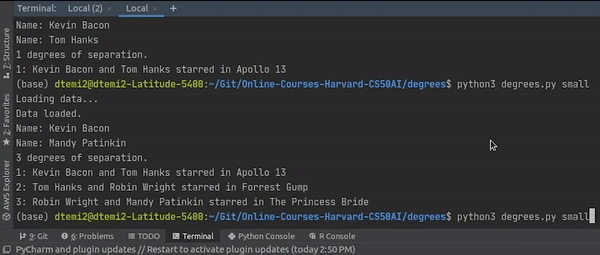
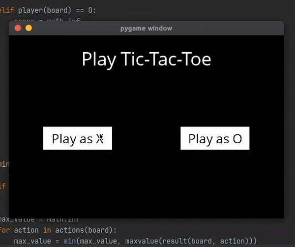
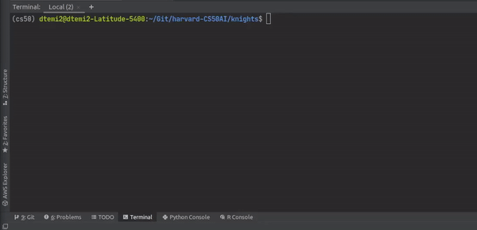
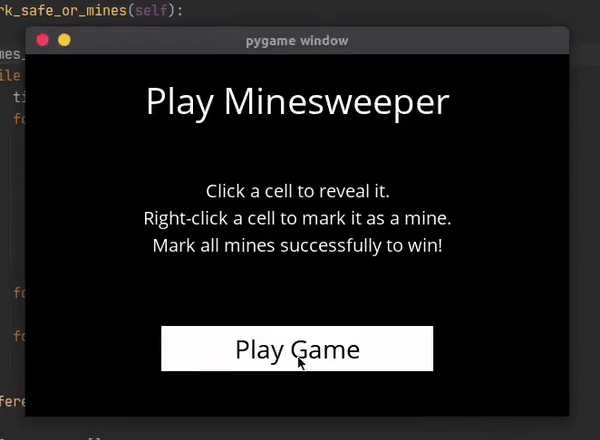
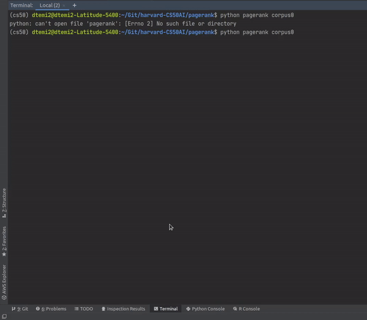
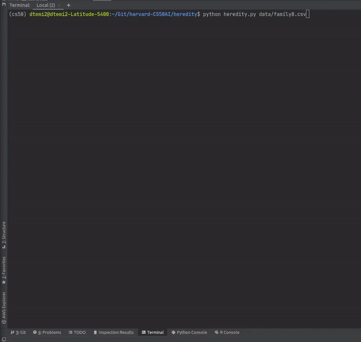
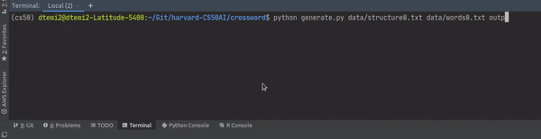
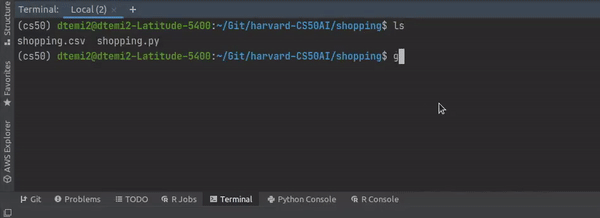

# harvard-CS50AI
This repository serves as a way for me to document my experience
with the [CS50 Artificial Intelligence class](https://cs50.harvard.edu/ai/2020/).

Following is just a little description about each of the assignments.
I do so to keep a thorough documentation on concepts that each assignment employs.

<h2>Week 0: Search</h2>

**Degrees (BFS)** [see directory](https://github.com/dtemir/harvard-CS50AI/tree/master/degrees):
    
* The assignment is about finding the shortest path between two nodes
* The database comes from IMDb, and the task is to tell how one actor is connected to another through their common movie casts
* The solution is based on Breadth-First Search (BFS) because the task requires the shortest path between nodes
* To implement the search, I used a Queue-based Frontier. The Frontier is filled with neighboring nodes that share the same parameter(movie)
* You can find the demonstration of how it works [here](https://www.youtube.com/watch?v=0bksDFskiRM&t=1s&ab_channel=DamirTemir).

    
**Tic-Tac-Toe (Minimax)** [see directory](https://github.com/dtemir/harvard-CS50AI/tree/master/tictactoe):

* The assignment is about writing an AI algorithm to play Tic-Tac-Toe optimally
* The pygame module provided inside the <code>runner.py</code> file was outside the scope of the project
* The solution is based on Minimax decision rule which perfectly works for games that clash two opponents against each other
    * The algorithm is all about calculating the best utility out of all possible solutions. 
    * The algorithm relies on calculating prospective steps that the opponent might take
* The <code>tictactoe.py</code> file (where the solution lies) consists of many minor functions that construct the game of Tic-Tac-Toe (finding out who is a winner, etc.)
I recommend paying better attention to the last function called <i>minimax</i>
    * The function determines which side AI plays for, and then finds the best optimal score that the AI can get
* You can find the demonstration of how it works [here](https://www.youtube.com/watch?v=jgmtzfJTEgY&ab_channel=DamirTemir).

<h2>Week 1: Knowledge</h2>

**Knights (Propositional Logic & Inference)** [see directory](https://github.com/dtemir/harvard-CS50AI/tree/master/knights):

* The assignment is about solving puzzles using propositional logic
* Using given module <code>logic.py</code>, the puzzles first need to be presented
   * We first need to define base knowledge in each of the knowledge bases, such as that knaves only lie and knight only tell the truth
   * Then, given the statements of symbols (e.g. Symbol A says "We're both knaves" and Symbol B says nothing), we need to represent them using logic
        *  This case involves using biconditionals to show that if A is a knight, his words are true and if not, they are lies
* Using logic, such as and (∧), or (∨), biconditional (↔), inference can be derived that has the answer
* You can find the demonstration of how it works [here](https://youtu.be/iIk04q98ArE).

**Minesweeper (Propositional Logic & Inference)** [see directory](https://github.com/dtemir/harvard-CS50AI/tree/master/minesweeper):

* The assignment is about solving minesweeper by drawing inference on every available state
* Each piece of knowledge is represented as a sentence that has a set of cells and a number of mines that the set contains
* By knowing that a set is a subset of another set, we can tell they share the number of mines, which means that we can eliminate potential cells from the set (which is inference)
* It is important to keep trying to derive inferences from the available knowledge every time something new is given or found
* You can find the demonstration of how it works [here](https://youtu.be/8DDpr0TY8Pw).

<h2> Week 2: Uncertainty</h2>

**Pagerank (Markov Models)** [see directory](https://github.com/dtemir/harvard-CS50AI/tree/master/pagerank):

* The assignment is about using probability to determine pagerank for html pages
* The <code>pagerank.py</code> has two functions: <code>sample_pagerank</code> and <code>iterative_pagerank</code>
    * Random Surfer Model (<code>sample_pagerank</code>) is about using transition models to represent a state in Markov Chain and choose among its links to pages at random
    * Iterative Algorithm (<code>iterative_pagerank</code>) is about using a recursive mathematical expression to see what the pagerank would be
* It is important to note that normalization of all the resulted vectors is required in <code>iterative_pagerank</code> as some overall probability might result in more than 1
* You can find the demonstration of how it works [here](https://www.youtube.com/watch?v=LxuCrbKrNvs).

**Heredity (Bayesian Networks)** [see directory](https://github.com/dtemir/harvard-CS50AI/tree/master/heredity):
* The assignment is about using a bayesian network that models the relationships of getting a certain gene and make inferences about a population
* We are given information about people, who their parents are, and whether they have a trait that is caused by a gene. The AI then infers the probability distribution for each person
* The <code>heredity.py</code> has base probabilities for people who do not have parents listed.
Using those base probabilities we can make inferences for their children based on the chances they inherited zero genes, one gene, or two genes and whether they exhibit a trait
* You can find the demonstration of how it works [here](https://www.youtube.com/watch?v=vHW-K2fDl-Y).

<h2> Week 3: Optimization </h2>

**Crossword (Constraint Satisfaction: Node & Arc Consistency with Backtracking Search)** [see directory](https://github.com/dtemir/harvard-CS50AI/tree/master/crossword)
* The assignment is about solving a crossword using backtracking search that incorporates arc and node consistency
* We are given three crossword grids and three word collections 
* The <code>generate.py</code> consists of a class that implements Variable and Crossword classes from <code>crossword.py</code>
    * It provides some base methods, but there rest (starting with <code>enforce_node_consistency</code>) had to be implemented
* To implement the backtracking search, the assignment of words to grid variables first had to be consistent in nodes and edges (arcs)
    * Node consistency is a unary constraint that requires all grid variables to only have potential words that are of the same length (grid variable of size 4 cannot fit word "Hello")
    * Arc consistency is a binary constraint that requires all grid variable to only have potential words that are unique from other variables and are consistent in terms of characters (grid variable has to have one identical character with another variable if they share a grid cell)
* This particular project was a pain in the ass because each class has numerous attributes, which makes it hard to navigate within data
* You can find the demonstration of how it works [here](https://www.youtube.com/watch?v=wtokjci-d8g&ab_channel=DamirTemir)

<h2> Week 4: Learning </h2>

**Shopping (KNN Classifier)** [see directory](https://github.com/dtemir/harvard-CS50AI/tree/master/shopping)
* The assignment is about using the provided data to train a nearest-neighbor classifier that would let us know if the user is going to purchase
* The provided data set has certain evidence attributes like <code>Administrative</code>, <code>Informational</code>, etc. Those attributes constitute <code>evidence</code> that we use to train model
* The data also has <code>Revenue</code> which indicates if the user bought something
* We first parse the data to buffer in <code>load_data</code>, then we use it to train model with scikit-learn's <code>KNeighborsClassifier</code>
* Finally, we need to benchmark the model.
  * For this we use the understanding of <code>sensitivity</code>, 
  that is the proportion of actual positive results to accurately predicted results, and <code>specificity</code>, 
  which is the proportion of actual negative results to accurately predicted results.
  * In other words, we compare positive actual information to positive predicted values and negative actual information to negative predicted values.
* You can find the demonstration of how it works [here](https://www.youtube.com/watch?v=BlXzYbwb_0U&ab_channel=DamirTemir)

